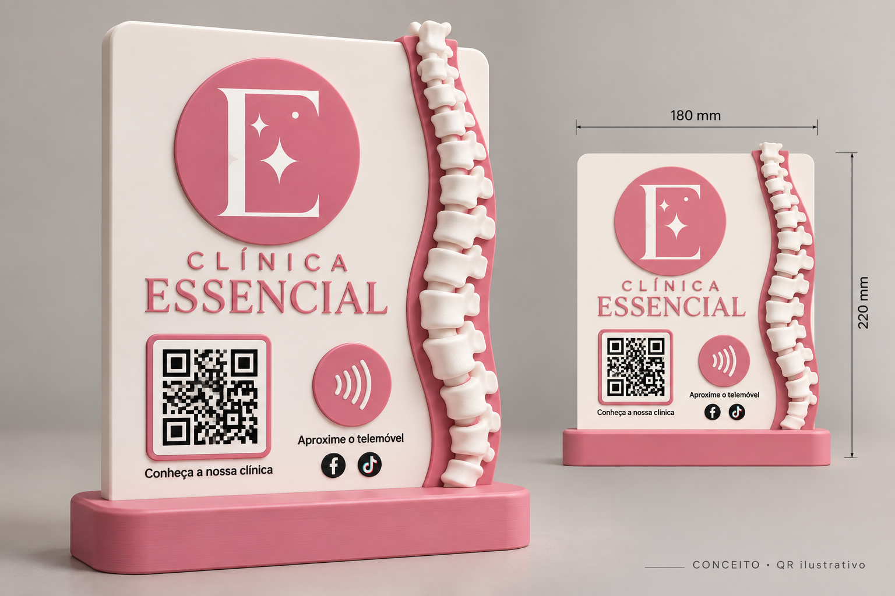

# Clínica Essencial — placa QR e NFC

Projeto de uma placa de balcão para impressão 3D e edição no Autodesk Fusion.

## Ficheiros

- **[Base Premium — download separado, encaixe original](downloads/essencial-base-premium.zip?raw=true)**
- [Base Premium — código Fusion](fusion/EssencialBasePremium/EssencialBasePremium.py)
- [Base Premium — medidas e instruções](fusion/EssencialBasePremium/README.md)
- [Base Premium — esquema das medidas](designs/essencial-base-premium-medidas.png)
- **[A1 + avaliações Google — download atual](downloads/essencial-fusion-a1-avaliacoes.zip?raw=true)**
- [A1 + avaliações Google — código Fusion](fusion/EssencialA1Reviews/EssencialA1Reviews.py)
- [A1 + avaliações Google — esquema atualizado](designs/essencial-a1-avaliacoes-esquema.png)
- [Instruções e endereços para programar NFC](fusion/EssencialA1Reviews/README.md)
- **[Bambu A1 — download (link Google ainda provisório)](downloads/essencial-fusion-a1.zip?raw=true)**
- [Bambu A1 — código Fusion](fusion/EssencialA1/EssencialA1.py)
- [Bambu A1 — esquema com dimensões completas](designs/essencial-a1-esquema.png)
- [Bambu A1 — instruções e pendência do link de avaliações](fusion/EssencialA1/README.md)
- **[V4 — download com QR de 64 mm](downloads/essencial-fusion-v4-qr64.zip?raw=true)**
- [V4 — código Fusion](fusion/EssencialV4/EssencialV4.py)
- [V4 — esquema atualizado](designs/essencial-v4-qr64-esquema.png)
- [V4 — dimensões e impressão](fusion/EssencialV4/README.md)
- **[V3 Fast — download da versão otimizada](downloads/essencial-fusion-v3-fast.zip?raw=true)**
- [V3 Fast — código e indicação de progresso](fusion/EssencialV3Fast/EssencialV3Fast.py)
- [V3 Fast — instruções](fusion/EssencialV3Fast/README.md)
- **[V3 — dois QR, símbolos e etiquetas NFC encapsuladas](fusion/EssencialV3/EssencialV3.py)**
- [Download do pacote Fusion V3](downloads/essencial-fusion-v3.zip?raw=true)
- [V3 — esquema frontal](designs/essencial-v3-esquema.png)
- [V3 — instruções de pausa e montagem](fusion/EssencialV3/README.md)
- [Placa Fusion com QR Instagram integrado](fusion/EssencialV2Instagram/EssencialV2Instagram.py)
- [Download: Fusion + STL QR + imagem](downloads/essencial-fusion-instagram.zip?raw=true)
- [STL: pastilha QR independente](downloads/instagram-qr-51mm.stl?raw=true)
- [QR Instagram — imagem](designs/instagram-qr.png)
- [Instruções de impressão e contraste do QR](fusion/README-Instagram.md)
- [Script V2 — duas peças e nova coluna](fusion/EssencialV2/EssencialV2.py)
- [Instruções e medidas do encaixe V2](fusion/EssencialV2/README.md)
- [Download do pacote Fusion V2](downloads/essencial-fusion-v2.zip?raw=true)
- [Script Python para Fusion](fusion/EssencialDraft/EssencialDraft.py)
- [Como executar no Fusion](fusion/README.md)
- [Download do pacote Fusion](downloads/essencial-fusion-draft.zip?raw=true)
- [Desenho conceptual](designs/clinica-essencial-conceito-v1.png)
- [Download do desenho em ZIP](downloads/clinica-essencial-draft.zip?raw=true)

O desenho conceptual mostra a primeira proposta. O script inclui uma alteração
posterior: logótipo a prolongar-se para fora do canto superior esquerdo, com a
mesma espessura da placa. Por isso, a imagem não representa exatamente o CAD.

## Estado do draft

A **Base Premium** substitui apenas a base: conserva 160 × 70 × 18 mm,
a ranhura útil 120,6 × 5,5 × 12,8 mm e a entrada alargada original.
Tem cantos R12, bordos superiores exteriores R2 e chanfro frontal de 8 mm,
sem alterar a zona de encaixe. O script é independente e cria um novo documento.

A versão atual **EssencialA1Reviews** mantém a peça completa com **208 × 242 mm**
e os QR de 64 mm. O Google abre o formulário de avaliação com o endereço que
o utilizador confirmou no navegador e no telemóvel. A matriz Google foi
regenerada com correção M para manter módulos de 1,422 mm; as cavidades NFC,
pausa Z=3,8 mm, encaixe e geração otimizada permanecem iguais. Use o mesmo
endereço de avaliações na etiqueta NFC inferior.

A versão anterior **Bambu A1** reorganiza o topo e reduz apenas o círculo do logótipo:
a placa completa, incluindo saliências e língua, fica com **208 × 242 mm**.
Com brim de 5 mm ocupa 218 × 252 mm. Mantém QR de 64 mm, etiquetas, pausa e
encaixe. **O QR Google ainda usa o link de partilha que abre pesquisa; o
endereço direto das avaliações está pendente e não foi substituído por um
endereço presumido.**

A **V4** aumenta os QR para 64 × 64 mm. A placa fica com 200 × 220 mm para
dar espaço aos símbolos, às zonas NFC e à coluna. Mantém a construção
otimizada dos QR, duas peças, as medidas da base/encaixe e a pausa após
Z=3,8 mm. Ambos os QR do esquema descodificam para os mesmos destinos.

A **V3 Fast** mantém a geometria da V3, mas gera os QR em duas extrusões
conjuntas em vez de 628 operações individuais. Inclui cálculo adiado dos
sketches e janela de progresso/cancelamento entre etapas. A igualdade dos
retângulos QR foi verificada; o tempo real no Fusion continua por confirmar.

A **V3** reorganiza a frente em duas linhas: Instagram/Google à esquerda,
respetivo QR no centro e símbolo contactless à direita. Não tem inscrições
“QR”/“NFC”. Mantém duas peças e inclui duas cavidades internas para etiquetas
NFC redondas de 25 mm, a inserir numa pausa após Z=3,8 mm. O E e as estrelas
foram redesenhados com curvas a partir da referência, sem barra central.
O logótipo é uma aproximação manual, não o vetor original. Consulte as
instruções antes de imprimir; ponte do teto, execução no Fusion e leitura
física ainda precisam de validação.

A variante **EssencialV2Instagram** inclui um QR funcional para
`https://www.instagram.com/clinicaessencial_setubal/`, em relevo e unido à
placa. O PNG e a projeção superior do STL foram descodificados para confirmar
o endereço; a impressão física e a execução da variante no Fusion continuam
pendentes. Use módulos pretos sobre fundo branco.

Placa de 180 × 220 × 5 mm, base separada, alojamento traseiro para etiqueta NFC
de 26 mm e zona reservada para QR. Na V2 sem Instagram, o QR não contém um endereço e a
etiqueta NFC tem de ser comprada e programada à parte. Letras são textos de
sketch, não sólidos para impressão. O logótipo é uma aproximação geométrica.

O utilizador confirmou que o script V1 executou no Fusion. A V2 substitui
os blocos por vértebras arredondadas com projeções curvas, tendo em conta um
bico de 0,4 mm. Cria duas peças, cada uma com um corpo sólido: placa e base.
A base tem uma ranhura de 5,5 mm para uma língua de 5 mm, com entrada alargada
e espaço no fundo. A V2 ainda precisa de execução no Fusion e teste físico
do encaixe; o draft não está validado para impressão final.

Os ficheiros entregues ficam neste repositório: scripts em `fusion/`, desenhos
em `designs/` e pacotes em `downloads/`.
